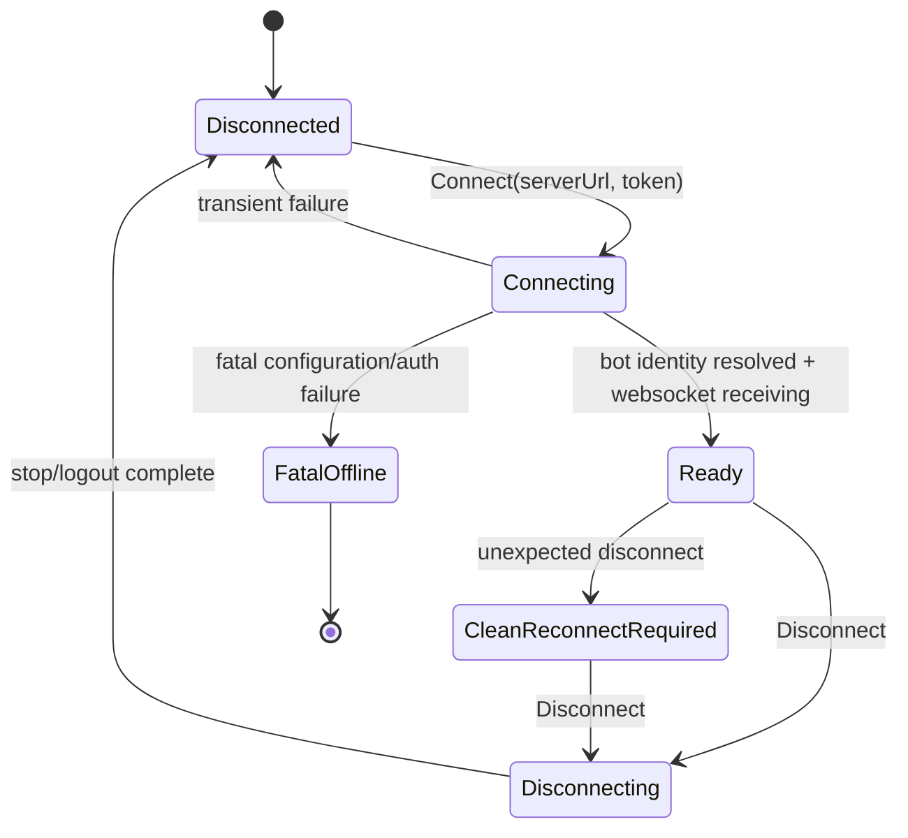

# Design

## Decision

Mattermost SHALL use a dedicated lifecycle actor for transport connection state,
matching Discord's proven pattern without merging connection state into
`MattermostGatewayActor`.

`MattermostGatewayActor` stays focused on routing normalized Mattermost messages
and callback interactions to conversations and sessions. The lifecycle actor
stays focused on socket state, transport events, bot identity, readiness, and
health snapshots.

Reconnect backoff remains in `MattermostChannel` for this change. That matches
the current Discord layering and keeps the migration small. A generic channel
lifecycle framework can be considered later only if Slack, Discord, and
Mattermost all need the same extracted behavior.

## Component Diagram

```mermaid
flowchart TD
    Host[.NET Host / IHostedService] --> MC[MattermostChannel]
    MC --> MGC[IMattermostGatewayClient]
    MGC --> LCA[MattermostNetGatewayLifecycleActor]
    LCA --> TR[IMattermostGatewayTransport]
    TR --> SDK[Mattermost.NET MattermostClient]
    SDK --> WS[Mattermost WebSocket]

    LCA -->|PublishMessageAsync| MGC
    MGC -->|MessageReceived event| MC
    MGC -->|CleanReconnectRequired event| MC
    MC -->|Tell MattermostGatewayMessage| MGA[MattermostGatewayActor]

    HTTP[/api/mattermost/actions] -->|MattermostGatewayInteraction| MGA
    MGA --> MCA[MattermostConversationActor]
    MCA --> MSBA[MattermostSessionBindingActor]
    MSBA --> SP[SessionPipeline]
    SP --> LLM[LlmSessionActor]
```

## Target State Machine



Mattermost.NET may not expose a Discord-style `READY` event. For Mattermost,
`Ready` means Netclaw has resolved the bot identity and the SDK has successfully
started WebSocket receiving.

## Responsibilities

### MattermostNetGatewayLifecycleActor

- Owns the current lifecycle state: disconnected, connecting, ready,
  clean-reconnect-required, disconnecting, fatal-offline.
- Subscribes Mattermost.NET SDK events once in `PreStart` and unsubscribes in
  `PostStop`.
- Serializes `Connect`, `Disconnect`, transport event, and `GetSnapshot`
  handling through the actor mailbox.
- Resolves and stores bot user id and username during successful connection.
- Drops or filters ingress while not ready and records channel telemetry.
- Emits clean reconnect requests when the transport disconnects unexpectedly.
- Replies to health snapshot requests with connected/ready/detail/bot identity.

### MattermostNetGatewayClient

- Becomes a thin actor-backed facade over `MattermostNetGatewayLifecycleActor`.
- Uses bounded `Ask` calls for connect, disconnect, and snapshot operations.
- Publishes normalized messages and clean reconnect requests through the
  existing client event surface.

### MattermostChannel

- Performs enabled/disabled and required configuration checks before connect.
- Contains fatal connection failures so one misconfigured channel does not crash
  the daemon.
- Runs the bounded reconnect backoff loop.
- Creates and registers `MattermostGatewayActor` only after the lifecycle actor
  reports a ready snapshot.
- Drains the gateway actor before disconnecting transport on shutdown.
- Reads lifecycle snapshots for `GetHealthAsync`.

### MattermostGatewayActor

- Unchanged routing actor.
- Owns event deduplication, ACL dispatch, conversation actor routing, and HTTP
  callback interaction routing.
- Does not own WebSocket connect/disconnect state.

## Migration Plan

1. Add `MattermostGatewaySnapshot` to Mattermost transport contracts with
   `IsConnected`, `IsReady`, `HealthDetail`, `BotUserId`, and `BotUsername`.
2. Add `GetSnapshotAsync` and `CleanReconnectRequired` to
   `IMattermostGatewayClient`.
3. Add `IMattermostGatewayTransport` as a testable wrapper over Mattermost.NET
   events and start/stop operations.
4. Add `MattermostSocketGatewayTransport` to adapt `MattermostClient` to the new
   transport interface.
5. Add `MattermostNetGatewayLifecycleActor` and move SDK event subscription into
   actor `PreStart`/`PostStop`.
6. Update `MattermostNetGatewayClient` to create the lifecycle actor and use
   `Ask` for connect, disconnect, and snapshot calls.
7. Update `MattermostChannel.TryConnectAsync` to require a ready snapshot before
   calling `CompleteConnectionSetup`.
8. Update `MattermostChannel.GetHealthAsync` to use `GetSnapshotAsync`.
9. Update `MattermostChannel` to subscribe to `CleanReconnectRequired` and start
   an immediate clean reconnect, matching Discord's pattern.
10. Preserve the existing gateway actor hierarchy and HTTP callback route.
11. Add lifecycle tests before broad cleanup.

## Non-Goals

- Do not create a generic channel base actor in this change.
- Do not change Slack or Discord behavior.
- Do not persist Mattermost callback action tokens.
- Do not change `MattermostGatewayActor` routing semantics.
- Do not change Mattermost session identity or `ChannelInput` construction.

## Risks / Trade-offs

- Mattermost.NET event semantics may differ from Discord.NET. The lifecycle actor
  should define readiness from Netclaw-observable operations: bot identity
  resolved and WebSocket receiving started.
- Keeping reconnect backoff in `MattermostChannel` duplicates some orchestration
  logic with Discord, but it avoids a premature shared framework.
- Tests need fakes that can count event subscription and publication calls so
  handler duplication cannot regress.
