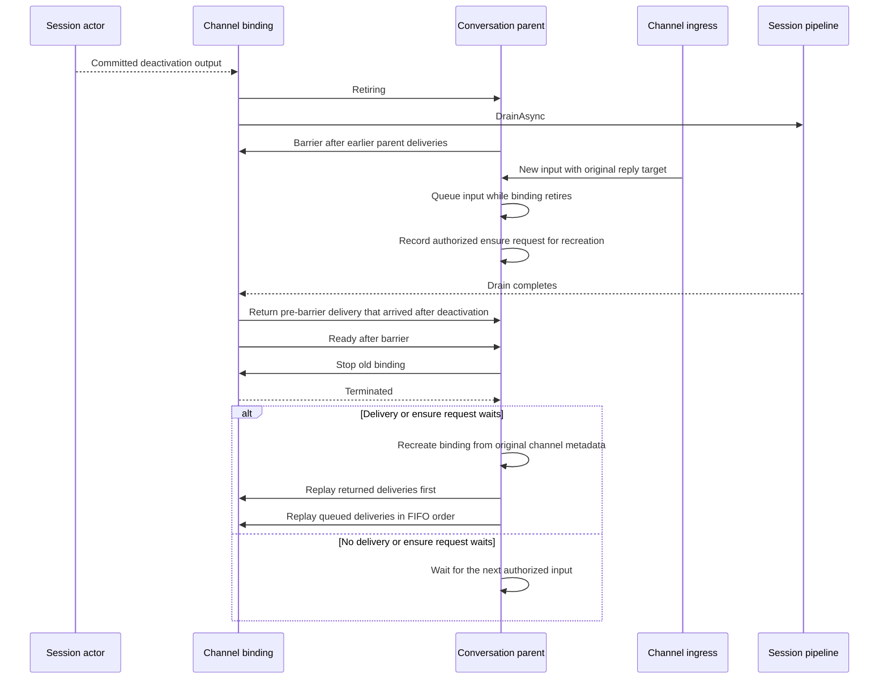

## Context

See [proposal.md](proposal.md). PRD-001 FR-001, FR-002, and FR-003 require stable thread identity, output delivery, and recovery. PRD-009 requires adapters to route through the session boundary. The [engineering glossary](../../../docs/spec/GLOSSARY.md) defines shared terms.

PR #2429 has a session-owned lifecycle prototype. Its two focused Slack and Discord passivation tests passed. The full solution run before fixture corrections reported 12,205 passed, 8 failed, and 98 skipped. Three fixture failures in new race tests were then corrected.

The Actors.Tests rerun reported 5,715 passed, 4 failed, and 40 skipped. All eight new lifecycle, drain-race, and router tests passed. The four Actor failures and one configuration failure still reflect old-contract expectations. The configuration failure expects a 30-minute idle-timeout default. The full solution was not rerun after the fixture corrections.

The three approval-recovery tests passed: `Idle_passivation_proceeds_with_pending_approval_and_response_resumes`, `Passivated_session_resumes_tool_batch_when_approval_arrives`, and `Idle_session_with_pending_interaction_redrives_when_approval_arrives`. The Actor results are in `/tmp/netclaw-session-lifetime-tests/actors-final/actors-final.trx`. The full result summary is in `/tmp/netclaw-session-lifetime-tests/summary.json`.

## Goals / Non-Goals

**Goals:**

- Keep session idle policy and active-work state in the session actor.
- Keep each channel binding alive until the session commits to stop.
- Preserve parent-queued deliveries across a graceful binding drain.
- Keep current channel authorization and approval recovery behavior.

**Non-Goals:**

- Guarantee delivery after actor or process failure.
- Add a gateway output route, durable outbox, new timer, activity classifier, or admission acknowledgement.
- Change approval semantics or force passivation while active work remains.

## Decisions

### Session-owned idle eligibility

Reuse the current session idle timer and set its default to one hour. The session checks actor-local work state before idle passivation. A shell job blocks passivation while its record has no `ReapedAtMs` value. A reaped record does not block. The current `Processing` phase already disables idle timeout and covers foreground child work. Do not add draft child-run state or query a remote job manager from each timeout. A journaled pending approval alone does not block passivation.

Subscriber count does not block idle passivation. The session emits its deactivation output only after it commits to stop. It does not emit deactivation when a passivation can still abort. An existing approval click can rehydrate a passivated session through the current route.

### Binding retirement and FIFO replay

Keep each binding's direct session output subscription. Remove its independent idle timeout. When the binding receives committed session deactivation, it tells its conversation parent that retirement has started before it awaits pipeline drain.

The parent sends a barrier after all earlier deliveries to that binding. It queues later input with the original payload and reply target. The binding returns any earlier delivery that it handles after deactivation without writing it to the drained pipeline. After drain, the binding handles the barrier and reports readiness. The parent stops the binding and waits for `Terminated`. If a returned or queued delivery waits, the parent recreates the binding from the original channel metadata and replays returned deliveries first. It then replays later queued deliveries in FIFO order. The parent also honors an authorized binding-ensure request that arrives during retirement. Mattermost proactive-thread setup uses this path without a `SessionBindingDelivery`. If neither a delivery nor an ensure request waits, the parent does not recreate a binding until the next authorized input arrives.

This guarantee ends when the old binding submits input to its local pipeline queue. `ChannelWriter<ChannelInput>.WriteAsync` confirms local queue admission, not session journal admission. Drain completes that writer and shuts down the shared kill switch. It does not await completion of the input sink. The parent cannot replay an input after the binding has consumed its delivery envelope and before the session confirms admission. This change does not add an admission acknowledgement or an input flush protocol.

This is a graceful-stop protocol. It does not promise recovery if the parent, binding, or process fails before replay. The parent owns the queue and the only binding recreation decision.

The diagram omits persistence and authorization steps. The conversation parent applies the current ingress ACL and routing checks before it queues new input. The replacement binding keeps its current per-command authorization checks.

### Conversation parent lifetime

An idle conversation parent stops only when it has no binding children. A live binding child keeps that parent available. After session deactivation, the binding stops; the parent can then stop when its idle timeout fires and it has no children.

### Existing prototype and test sequence

The prototype lives in [PR #2429](https://github.com/netclaw-dev/netclaw/pull/2429), commit [`62d8b46284df1072c4a2aa5242309017cc51c816`](https://github.com/netclaw-dev/netclaw/commit/62d8b46284df1072c4a2aa5242309017cc51c816). The focused Slack and Discord passivation tests passed. The retirement race tests now pass after the binding and parent barrier fix.

Five old-contract failures remain: four Actor assertions and one configuration default. Reconcile them before declaring the full test feed green. Keep the approval-recovery tests green. Do not change the approval passivation rule in this proposal.

## Risks / Trade-offs

- [Parent replays input before the old binding stops] → Wait for `Terminated` before creating the replacement or replaying buffered input.
- [Input arrives in the old binding mailbox before the barrier] → Return it to the parent after drain begins; do not write it to the retired pipeline.
- [The binding submitted input to its local queue before deactivation] → State that the barrier does not confirm session admission; track an acknowledgement or flush contract as separate work.
- [Replay changes the reply target or channel metadata] → Store the original reply target and recreate from the original binding properties.
- [An unauthorized sender reaches the replacement] → Apply the existing parent ingress ACL before queue admission and keep the binding's per-command authorization checks.
- [A process fails after input enters the actor-local queue] → Keep this limitation explicit; durable admission and crash replay are out of scope.
- [A pending approval loses its session actor] → Preserve the current journaled approval route and its recovery tests.

## Migration Plan

1. Keep the current PR #2429 prototype and its two focused passivation tests.
2. Prove the parent-to-binding drain race with a failing test before the fix.
3. Add the parent retirement barrier and replay path for Slack, Discord, and Mattermost.
4. Test queued delivery order, single replay, original reply targets, channel authorization, and approval recovery.
5. Reconcile the five old-contract failures after the race tests pass.
6. Run strict OpenSpec validation and the required repository checks before merge.

Rollback removes the retirement protocol and restores the prior binding lifecycle. It does not require a persisted data migration.
