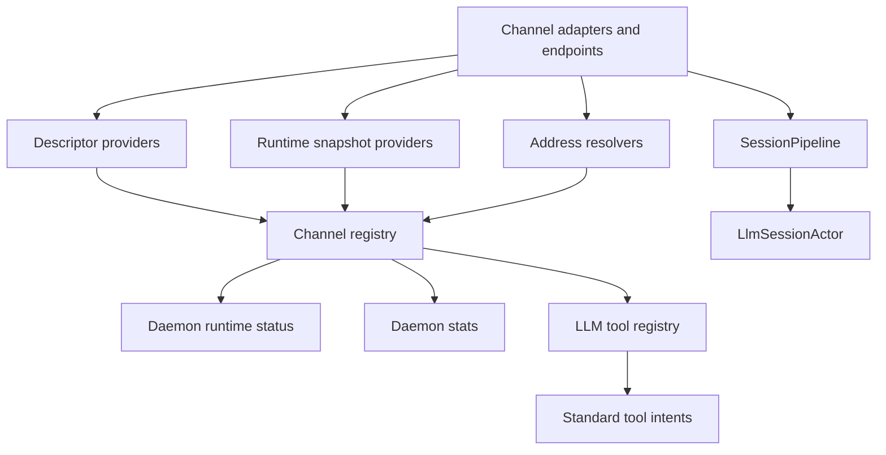

# Design

## Decision

Standardize the channel seam through descriptors, runtime snapshots, address
resolution, and tool intent schemas. Do not start by creating a shared channel
base actor or rewriting adapter internals.

Adapters keep their platform-specific implementation details. The daemon and
LLM-facing tool registry consume a standard description of what each adapter can
do, how healthy it is, and how names resolve to platform addresses.

Mattermost lifecycle actorization remains a valid reliability fix, but it is no
longer the top-level change. It becomes one stateful-adapter task that should be
implemented after Mattermost can report the same descriptor and runtime snapshot
shape as Slack, Discord, and future remote chat adapters.

## Glossary And Abstractions

These examples are illustrative contracts, not final type names. The intent is to
show the seam each term describes and how the daemon would use it.

### Channel Descriptor

A stable description of what an adapter, logical channel, or endpoint is and what
it can do. This is mostly configuration/capability metadata, not live health.

Abstraction:

```csharp
public sealed record ChannelDescriptor(
    ChannelDescriptorKey Key,
    ChannelType? ChannelType,
    ChannelSourceKind Kind,
    string DisplayName,
    bool IsEnabled,
    ChannelCapabilities Capabilities,
    IReadOnlySet<ChannelToolIntentKind> ToolIntents,
    IReadOnlySet<ChannelAddressKind> AddressKinds);

public interface IChannelDescriptorProvider
{
    ChannelDescriptor GetDescriptor();
}
```

Interaction:

```csharp
var descriptor = slackDescriptorProvider.GetDescriptor();

if (descriptor.Capabilities.HasFlag(ChannelCapabilities.InteractiveApproval))
{
    toolRegistry.IncludeApprovalAwareTools(descriptor.Key);
}
```

### Channel Source Kind

The category of source represented by a descriptor. This avoids treating a
daemon endpoint such as SignalR as if it were a Slack-like remote workspace.

Abstraction:

```csharp
public enum ChannelSourceKind
{
    RemoteChatChannel,
    LocalClientChannel,
    DaemonEndpoint,
    InternalSource,
    HttpIngressSource,
    NonInteractiveClient
}
```

Interaction:

```csharp
var descriptors = registry.ListDescriptors();
var endpoints = descriptors.Where(d => d.Kind == ChannelSourceKind.DaemonEndpoint);
var chatChannels = descriptors.Where(d => d.Kind == ChannelSourceKind.RemoteChatChannel);
```

### Channel Registry

The daemon-owned index of descriptors, runtime snapshot providers, and address
resolvers. It routes operations to the selected descriptor instead of guessing
which platform a user meant.

Abstraction:

```csharp
public interface IChannelRegistry
{
    IReadOnlyCollection<ChannelDescriptor> ListDescriptors();

    ValueTask<ChannelRuntimeSnapshot> GetSnapshotAsync(
        ChannelDescriptorKey key,
        CancellationToken cancellationToken);

    IChannelAddressResolver GetResolver(
        ChannelDescriptorKey key,
        ChannelAddressKind addressKind);
}
```

Interaction:

```csharp
foreach (var descriptor in registry.ListDescriptors())
{
    var snapshot = await registry.GetSnapshotAsync(descriptor.Key, ct);
    status.AddChannel(descriptor, snapshot);
}
```

### Runtime Snapshot

A live, point-in-time report of an adapter or endpoint's current operational
state. This is not persisted state; it is used by status, stats, tool discovery,
and health reporting.

Abstraction:

```csharp
public sealed record ChannelRuntimeSnapshot(
    ChannelDescriptorKey Key,
    bool IsEnabled,
    ChannelHealthStatus Health,
    string? HealthDetail,
    bool? IsConnected,
    bool? IsReady,
    ChannelPrincipal? Principal,
    ChannelEndpointIdentity? Endpoint,
    ChannelActivitySnapshot? Activity);

public interface IChannelRuntimeSnapshotProvider
{
    ChannelDescriptorKey Key { get; }

    ValueTask<ChannelRuntimeSnapshot> GetSnapshotAsync(
        CancellationToken cancellationToken);
}
```

Interaction:

```csharp
var snapshot = await mattermostSnapshotProvider.GetSnapshotAsync(ct);

if (snapshot is { IsEnabled: true, IsReady: false })
{
    logger.LogWarning("Mattermost is not ready: {Detail}", snapshot.HealthDetail);
}
```

### Address Resolver

A descriptor-scoped resolver for stable IDs and user-facing names. Slack,
Discord, Mattermost, SignalR, Reminder, and Webhook do not share one mega
resolver; each descriptor provides only the namespaces it supports.

Abstraction:

```csharp
public sealed record ChannelAddressResolutionRequest(
    ChannelDescriptorKey ChannelKey,
    ChannelAddressKind AddressKind,
    string Query,
    bool RequireSingleMatch);

public sealed record ResolvedChannelAddress(
    ChannelDescriptorKey ChannelKey,
    ChannelAddressKind AddressKind,
    string StableId,
    string DisplayName);

public interface IChannelAddressResolver
{
    ChannelDescriptorKey ChannelKey { get; }

    ValueTask<ChannelAddressResolutionResult> ResolveAsync(
        ChannelAddressResolutionRequest request,
        CancellationToken cancellationToken);
}
```

Interaction:

```csharp
var resolver = registry.GetResolver(slackKey, ChannelAddressKind.Destination);

var result = await resolver.ResolveAsync(
    new ChannelAddressResolutionRequest(
        slackKey,
        ChannelAddressKind.Destination,
        "#ops-alerts",
        RequireSingleMatch: true),
    ct);

var destination = result.RequireSingle();
```

### Tool Intent Schema

The normalized argument model used by LLM-facing tools. Tool names can be
standardized, but adapter-specific execution still happens behind the registry
and descriptor-selected channel implementation.

Abstraction:

```csharp
public sealed record SendChannelMessageIntent(
    ChannelDescriptorKey ChannelKey,
    ResolvedChannelAddress Destination,
    string Text,
    string? ThreadOrRootId = null);

public interface IChannelToolIntentExecutor
{
    ValueTask ExecuteAsync(
        SendChannelMessageIntent intent,
        ToolExecutionContext context,
        CancellationToken cancellationToken);
}
```

Interaction:

```csharp
var destination = await channelTools.ResolveDestinationAsync(
    channelKey: mattermostKey,
    query: "release-war-room",
    cancellationToken: ct);

await channelTools.SendMessageAsync(
    new SendChannelMessageIntent(
        mattermostKey,
        destination,
        "Deploy finished successfully."),
    toolContext,
    ct);
```

### Stateful Transport Lifecycle Owner

The adapter-specific component that serializes socket/API lifecycle state for a
remote chat adapter. It can be an actor, hosted-service state machine, SDK
facade, or another single owner. The standard contract is the observable
snapshot and lifecycle behavior, not the implementation shape.

Abstraction:

```csharp
public interface IStatefulChannelLifecycleOwner
{
    event Func<string, Task>? CleanReconnectRequired;

    ValueTask<ChannelRuntimeSnapshot> ConnectAsync(
        CancellationToken cancellationToken);

    ValueTask DisconnectAsync(CancellationToken cancellationToken);

    ValueTask<ChannelRuntimeSnapshot> GetSnapshotAsync(
        CancellationToken cancellationToken);
}
```

Interaction:

```csharp
lifecycle.CleanReconnectRequired += reason =>
{
    reconnectQueue.Enqueue(new CleanReconnectRequest(channelKey, reason));
    return Task.CompletedTask;
};

var snapshot = await lifecycle.GetSnapshotAsync(ct);

if (snapshot.IsReady != true)
{
    ingressMetrics.RecordFilteredWhileNotReady(channelKey);
    return;
}
```

## Transport And Channel Taxonomy

Netclaw needs to distinguish logical conversation sources from process/network
transport endpoints.

| Kind | Examples | Descriptor Meaning |
|------|----------|--------------------|
| Remote chat channel | Slack, Discord, Mattermost | External workspace/server adapter that can receive messages, send replies, resolve users/destinations, and report remote socket or API health. |
| Local client channel | TUI, future Web UI | Logical conversation source created by a local client over the daemon API. The session is channel-like, but the underlying network endpoint is SignalR. |
| Daemon endpoint | SignalR hub | Server transport endpoint used by local clients. It has endpoint health and connected-client state, but it is not itself a user-facing workspace/channel. |
| Internal source | Reminder, scheduler | Daemon-owned source that creates session turns without an external chat workspace. |
| HTTP ingress source | Webhook | External HTTP event source with routing policy, not necessarily a conversational channel. |
| Non-interactive client | Headless | One-shot or request/response source with no ongoing chat surface. |

This split lets SignalR be treated like a first-class operational endpoint
without forcing it to pretend to be Slack-like. TUI sessions still get a logical
channel descriptor because they participate in session routing and approval
capabilities.

## Component Diagram



## Standard Descriptor Shape

Each adapter or endpoint reports a stable descriptor with these concepts:

- Stable key, channel type, display name, and kind.
- Whether it is enabled by configuration.
- Capabilities: receive messages, send messages, direct messages, threaded
  conversations, interactive approvals, file ingress, file egress, user lookup,
  destination lookup, proactive messages, and runtime health.
- Tool intents it supports, such as send message, lookup user, and lookup
  destination.
- Address namespaces it can resolve, such as user, channel, room, thread, DM,
  session, webhook source, or schedule target.

The descriptor describes what the adapter promises. It must not grant ACL
permissions by itself. Actual turn authorization continues to flow through
`ChannelInput` trust context and existing policy checks.

## Runtime Snapshot Shape

Each adapter or endpoint reports a runtime snapshot with these concepts:

- Descriptor key and channel type.
- Enabled state.
- Health status and detail.
- Connected state when meaningful.
- Ready state when meaningful.
- Bot or service principal identity when the adapter has one.
- Endpoint identity when the item is a daemon transport endpoint.
- Last known activity counters or timestamps when available.

Ready is adapter-specific but comparable. For a remote socket adapter, ready
means it can accept inbound events and send replies. For a local client channel,
ready means the session endpoint can route messages. For an internal source,
ready means its scheduler or trigger is registered.

## Address Resolution

Address resolution is standardized as an intent, not as one platform's ID model.
Each descriptor-backed adapter provides its own resolver for the address
namespaces it supports. The channel registry routes a resolution request to the
resolver associated with the selected descriptor or channel type; it does not use
a global resolver that guesses across platforms. Resolvers accept a query and an
address kind. They can return exact matches, candidate matches, or a failure.

Rules:

- Stable IDs are accepted when supplied.
- User-facing names are searchable where the backing platform supports it.
- Ambiguous names fail loudly with candidates instead of choosing the first
  match.
- Unsupported address kinds fail loudly for the selected descriptor.
- Resolvers do not silently fall back from one namespace to another.
- Resolved addresses carry both display data and stable platform IDs.

## LLM-Facing Tool Intents

The tool registry should describe channel tools in terms of standard intents:

- `send_message`: destination, text, optional thread/root target, optional
  audience/context hints.
- `lookup_user`: query, optional channel key, optional exact-only flag.
- `lookup_destination`: query, destination kind, optional channel key,
  optional exact-only flag.

Existing tool names such as `send_slack_message`, `send_discord_message`, and
`send_mattermost_message` are not compatibility requirements. The implementation
may rename them to the standardized tool names once the registry can enumerate
descriptors and resolvers reliably. System skills, CLI/help text, and evals must
be updated in the same implementation change when tool names change.

## Stateful Transport Lifecycle

Stateful remote chat adapters must expose lifecycle through the standard runtime
snapshot. They may implement that lifecycle with actors, hosted services, SDK
callbacks, or another serialized owner, but the observable behavior must be the
same:

- Health reports disconnected, connecting, ready, degraded, and not-ready states
  consistently.
- Ingress is gated while the adapter is not ready.
- Reconnects do not duplicate SDK event handlers.
- Unexpected disconnects can request a clean reconnect when the platform SDK
  requires a full stop/start cycle.

Mattermost likely needs an actor-owned lifecycle implementation to satisfy these
requirements. That should be implemented after the standardized snapshot shape
exists.

## Migration Plan

1. Add descriptor, runtime snapshot, address-resolution, and tool-intent
   contracts without changing adapter behavior.
2. Add contract tests that enumerate every `ChannelType` and require either a
   logical channel descriptor or an explicit endpoint/internal-source descriptor.
3. Adapt existing Slack, Discord, Mattermost, TUI, Headless, SignalR, Reminder,
   and Webhook surfaces to report descriptors and snapshots using their current
   behavior.
4. Change daemon runtime status and stats to consume the registry instead of
   hard-coded Slack/Discord lists.
5. Normalize Slack, Discord, and Mattermost send/lookup tools onto standard
   intent schemas and rename current per-channel tools where needed.
6. Add name-searchable user and destination resolvers for supported platforms.
7. Only after descriptors and snapshots are stable, implement adapter-specific
   lifecycle fixes such as Mattermost actorization.

## Non-Goals

- Do not rewrite all adapters in one pass.
- Do not create a generic channel base actor in this change.
- Do not change session identity formats.
- Do not weaken ACL, audience, principal, boundary, or provenance requirements.
- Do not make SignalR pretend to be a remote chat workspace.

## Risks / Trade-offs

- A descriptor model can become too abstract. Keep it tied to current runtime
  consumers: status, stats, tools, health, and address resolution.
- Generic tools can hide platform-specific constraints. Preserve platform
  capability flags and fail loudly when a requested intent is unsupported.
- SignalR needs special handling because it is both the daemon API endpoint and
  the transport used by local logical channels. Treat endpoint health and logical
  channel capability as separate records.
- Mattermost lifecycle remains a reliability risk until actorized, but delaying
  it avoids changing adapter internals before the shared seam is defined.
